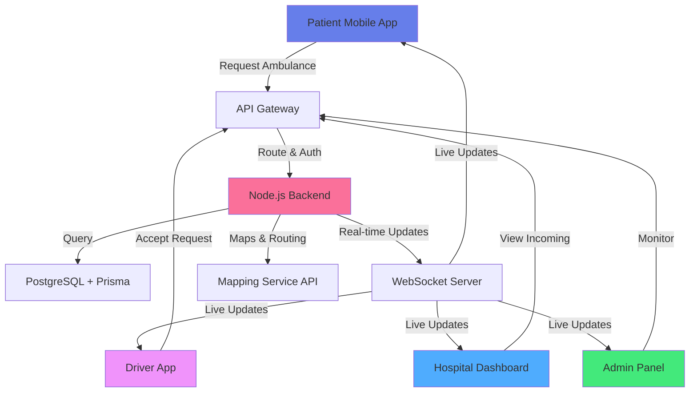

<div align="center">

<!-- Animated Banner -->


<p>
  
</p>

### 🚨 *When Every Second Counts, Technology Responds* 🚨

[](https://nextjs.org/)
[](https://nodejs.org/)
[](https://www.typescriptlang.org/)
[](https://www.prisma.io/)
[](https://www.postgresql.org/)
[](https://www.docker.com/)


---

</div>

## 🎯 Project Vision

**Rakshak** is a comprehensive emergency response platform designed to bridge the critical gap between ambulances, hospitals, drivers, and patients. In emergency situations where every second matters, our intelligent system coordinates real-time logistics, optimizes routes, and ensures seamless communication across all stakeholders.

<div align="center">

### ⚡ *Transforming Emergency Medical Services Through Technology* ⚡

</div>

---

## 🌈 Multi-Role Architecture

Rakshak supports **four distinct user types**, each with specialized dashboards and capabilities:

<table>
<tr>
<td width="25%" align="center">

### 👤 **Patient/User**


**Request ambulances instantly**
- Track ambulance location
- View ETA & driver details
- Emergency contact system
- Medical history access

</td>
<td width="25%" align="center">

### 🚗 **Driver**


**Navigate efficiently to save lives**
- Accept/decline ride requests
- Optimized route guidance
- Patient information preview
- Real-time traffic updates

</td>
<td width="25%" align="center">

### 🏥 **Hospital**


**Prepare for incoming emergencies**
- View incoming patients
- Bed availability status
- Patient medical records
- Staff coordination panel

</td>
<td width="25%" align="center">

### 🛡️ **Admin**


**Oversee the entire ecosystem**
- Monitor all ambulances
- Analytics & reporting
- User management
- System configuration

</td>
</tr>
</table>

---

## ✨ Feature Highlights

<div align="center">

| Feature | Description | Status |
|---------|-------------|--------|
| 🗺️ **Real-Time Mapping** | Live ambulance tracking with WebSocket integration | ✅ Active |
| 📍 **Smart Routing** | AI-powered route optimization considering traffic | ✅ Active |
| 🔔 **Instant Notifications** | Push alerts for all critical events | ✅ Active |
| 📊 **Analytics Dashboard** | Comprehensive insights and performance metrics | ✅ Active |
| 🎨 **Modern UI/UX** | Responsive design with smooth animations | ✅ Active |
| 🔐 **Secure Authentication** | Role-based access control with JWT | ✅ Active |
| 💾 **Database Optimization** | Efficient queries with Prisma ORM | ✅ Active |
| 🐳 **Docker Support** | Containerized deployment ready | ✅ Active |
| 📱 **Mobile Responsive** | Works seamlessly on all devices | ✅ Active |
| 🌐 **API Integration** | RESTful APIs for third-party integration | ✅ Active |

</div>

---

## 🚀 Quick Start Guide

### Prerequisites

Ensure you have the following installed:
- **Node.js** (v18.x or higher)
- **npm** or **yarn**
- **PostgreSQL** (v14 or higher)
- **Docker** (optional, for containerization)

### Installation

```bash
# Clone the repository
git clone https://github.com/aashutoshkumarbhardwaj/Rakshak-ambulance-.git

# Navigate to project directory
cd Rakshak-ambulance-

# Install dependencies
npm install

# Set up environment variables
cp .env.example .env
# Edit .env with your configuration

# Set up database
npx prisma generate
npx prisma db push

# Run development server
npm run dev
```

Visit `http://localhost:3000` and witness the magic! 🎉

### 🐳 Docker Deployment

```bash
# Build and run with Docker Compose
docker-compose up --build

# Access the application
# Frontend: http://localhost:3000
# Backend API: http://localhost:4000
```

---

## 🛠️ Technology Stack

<div align="center">

### Frontend Architecture


### Backend Infrastructure


### DevOps & Tools


</div>

---

## 📸 Visual Gallery

<div align="center">

### 🎭 Dashboard Previews


</div>

---

## 🎯 System Architecture



---

## 📂 Project Structure

```
Rakshak-ambulance-/
├── 📱 frontend/               # Next.js application
│   ├── components/            # Reusable React components
│   ├── pages/                 # Next.js pages & routes
│   ├── styles/                # Global styles & Tailwind
│   ├── hooks/                 # Custom React hooks
│   ├── utils/                 # Helper functions
│   └── public/                # Static assets
│
├── ⚙️ backend/                # Node.js + Express API
│   ├── controllers/           # Route controllers
│   ├── models/                # Prisma models
│   ├── routes/                # API endpoints
│   ├── middleware/            # Auth & validation
│   ├── services/              # Business logic
│   └── prisma/                # Database schema
│
├── 🐳 docker/                 # Docker configurations
│   ├── Dockerfile.frontend
│   ├── Dockerfile.backend
│   └── docker-compose.yml
│
├── 🔧 .github/                # CI/CD workflows
│   └── workflows/
│       └── deploy.yml
│
└── 📄 README.md               # You are here!
```

---

## 🤝 Contributing

We welcome contributions from the community! Whether you're fixing bugs, adding features, or improving documentation, your help makes Rakshak better.

### How to Contribute

1. **Fork** the repository
2. **Create** a feature branch (`git checkout -b feature/AmazingFeature`)
3. **Commit** your changes (`git commit -m 'Add some AmazingFeature'`)
4. **Push** to the branch (`git push origin feature/AmazingFeature`)
5. **Open** a Pull Request

### Code of Conduct

Please be respectful and constructive. We're all here to save lives through technology! 💙

---

## 🐛 Issues & Feature Requests

Found a bug or have an idea? We'd love to hear from you!

- 🐞 **Report Bugs**: [Open an issue](https://github.com/aashutoshkumarbhardwaj/Rakshak-ambulance-/issues)
- 💡 **Feature Requests**: [Suggest features](https://github.com/aashutoshkumarbhardwaj/Rakshak-ambulance-/issues)
- 📧 **Contact**: Reach out for collaborations

---

## 📊 Project Stats

<div align="center">


</div>

---

## 📜 License

This project is licensed under the **MIT License** - see the [LICENSE](LICENSE) file for details.

```
MIT License - Feel free to use, modify, and distribute!
Commercial use allowed | Modification allowed | Distribution allowed
```

---

## 🙏 Acknowledgments

- 🚑 Inspired by real-world emergency responders
- 💻 Built with love by the open-source community
- 🌟 Special thanks to all contributors and supporters
- 🏥 Dedicated to healthcare workers worldwide

---

<div align="center">

### 💖 Made with passion for saving lives 💖


**⭐ Star this repo if you find it helpful! ⭐**

[](https://github.com/aashutoshkumarbhardwaj)

*Every star helps us reach more developers and potentially save more lives!*

---

**Built with ❤️ by developers who care**

</div>
